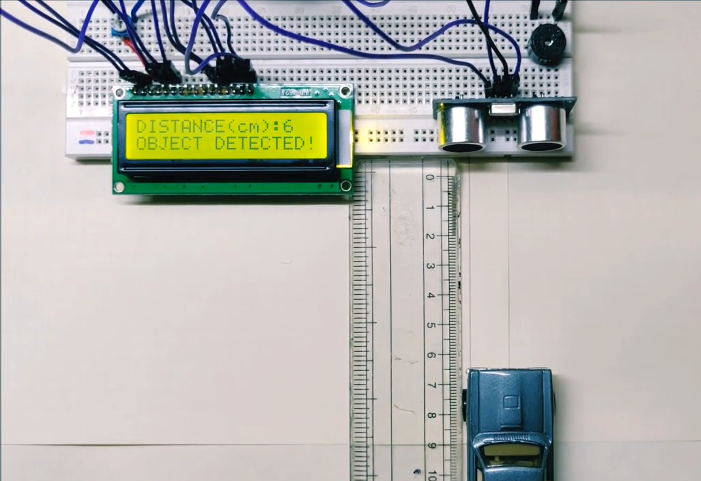

# Iot-Project
.It is for the framers to save the Crops from animals. 
.It helps farmers by giving buzzer Sound if Animals passes Near the field. 
.It alternative to electric fence to save the crops and animals. 

# Materials Used  
 .Arduino board 
.10k ohm potentiometer 
.16×2 LCD display 
.Buzzer 
.Ultrasonic sensor (HC-SR04) 
.Breadboard and hook-up wires 
.Webcam 
.Pir Sensor 
# Images of The setup Using tinker cad
 
  
 # Implementation
 
 
 
# Code
 
